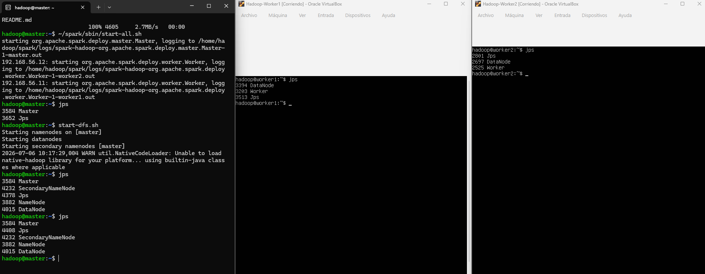
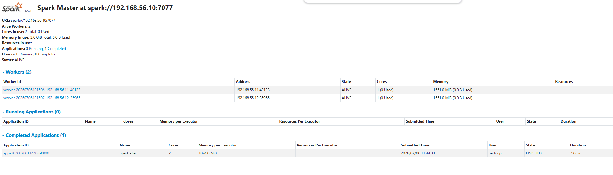

# Examen Final
# Integrantes

# Conexión
Para este examen, hemos usado el hadoop cluster creado en el examen parcial, pero ahora instalamos spark en el master y copiamos la configuración en worker1 y worker2 los cuales será nuestros esclavos y el master de hadoop cluster pasará a ser el master de spark cluster.

También podemos verificar su conexión, entrando al puerto 8080 con la IP del master

# Ip's
Como usamos la misma configuración, cabe resaltar la configuración de IP's que poseía el master y cada worker

- master: 192.168.56.10
- worker1: 192.168.56.11
- worker2: 192.168.56.12

# Datasets
Los datasets a tratar se ubican en la carpeta datasets, y este es un dataset de Afilados REP por mes en el año 2023, contando con los siguientes datasets:

- [Marzo 2023](./datasets/Afiliados_REP_Marzo2023(in).csv)
- [Junio 2023](./datasets/Afiliados_REP_Junio2023(in).csv)
- [Setiembre 2023(./datasets/Afiliados_REP_Setiembre2023(in).csv)
- [Diciembre 2023](./datasets/Afiliados_REP_Diciembre2023(in).csv)

# Copiar archivos
Para copiar archivos desde la máquina local, hasta el wsl y de ahí hasta la conexión ssh de hadoop, usaremos el siguiente comando 
´´´bash
scp /mnt/c/Users/chris/Downloads/Macrodatos_26-1/EFinal/datasets/*.csv hadoop@192.168.56.10:~/
´´´

Luego en el master verificamos
´´´bash
hadoop@master:~$ ls
 'Afiliados_REP_Diciembre2023(in).csv'   Parcial
 'Afiliados_REP_Junio2023(in).csv'       datos_prueba.txt
 'Afiliados_REP_Marzo2023(in).csv'       hadoop
 'Afiliados_REP_Setiembre2023(in).csv'   hadoop_data
 ITS_2025_limpio.csv                     spark
hadoop@master:~$
´´´

# Moviendo archivos csv al HDFS
´´´bash
# 1. Crear la carpeta en HDFS
hdfs dfs -mkdir /examen_onp

# 2. Subir los 4 archivos CSV al mismo tiempo
hdfs dfs -put Afiliados*.csv /examen_onp/

# 3. Verificar que estén ahí
hdfs dfs -ls /examen_onp
´´´

# Requisitos
El archivo examen.scala cumple las 3 secciones del enunciado
1. Requisito: "Archivos json generados para las consultas sql"

Dónde está en el código: En la sección 2. GENERACIÓN DE ARCHIVOS JSON.

Qué hace: Spark agarra los datos limpios y los divide en dos tablas: json_activos (los que sí aportan) y json_inactivos (los que no aportan), y los guarda en el HDFS.

2. Requisito: "Consultas sql sobre el json generado"

Dónde está en el código: En la sección 3. CONSULTAS SQL SOBRE LOS JSON.

Qué hace: El código vuelve a leer el archivo JSON que acaba de crear (json_activos) y ejecuta las dos consultas directamente sobre él usando .sql():

Consulta 1: Calcula el sueldo promedio por cada departamento y muestra el Top 5 de los departamentos con mejores sueldos.

Consulta 2: Calcula la suma total de dinero aportado dividiéndolo por sexo (masculino vs femenino).

3. Requisito: "Consultas Spark ML (Regresión y Clasificación con campos decimales)"

Dónde está en el código: En las secciones 5. REGRESIÓN y 6. CLASIFICACIÓN.

Qué hace:

Para Regresión (Campos decimales): Usa el Random Forest Regressor y la Regresión Lineal para predecir el monto exacto de la remuneración (sueldo) basándose en la edad, las semanas trabajadas y el monto de aporte. Muestra el RMSE y R2.

Para Clasificación: Usa el Multilayer Perceptron (Red Neuronal) y el Random Forest Classifier para predecir si una persona es aportante (1) o no aportante (0) según su edad, sexo y semanas de trabajo. Muestra el Accuracy.

# Ejecuciones

## MonoNodo

Al ejecutar el script con el comando
´´´bash
~/spark/bin/spark-shell -i examen.scala
´´´
Ejecutamos el archivo [examen.scala](./src/examen.scala) con un solo nodo el cual es el master, por lo que este nodo sufrirá con todo el peso de cargar miles de datos generando que su CPU se ocupe demasiado y el tiempo de ejecución sea muy prolongado, en este caso, para analizar todo el dataset obtenido y ejecutar los algoritmos de regresión y clasificación, notamos que el tiempo total es de
´´´bash
TIEMPO TOTAL DE EJECUCIÓN: 1973.77 segundos
´´´
Los datos obtenidos fueron
´´´bash
hadoop@master:~$ ~/spark/bin/spark-shell -i examen.scala
Setting default log level to "WARN".
To adjust logging level use sc.setLogLevel(newLevel). For SparkR, use setLogLevel(newLevel).
26/07/06 11:01:44 WARN NativeCodeLoader: Unable to load native-hadoop library for your platform... using builtin-java classes where applicable
Spark context Web UI available at http://master:4040
Spark context available as 'sc' (master = local[*], app id = local-1783335707608).
Spark session available as 'spark'.
26/07/06 11:02:00 WARN SparkSession: Using an existing Spark session; only runtime SQL configurations will take effect.
--- LEYENDO DATOS DESDE HDFS ---
[Stage 0:>                                                                                                                            
[Stage 1:>                                                                                                                            
--- GENERANDO ARCHIVOS JSON EN HDFS ---
[Stage 2:>                                                                                                                            
[Stage 3:>                                                                                                                            
--- EJECUTANDO CONSULTAS SPARK SQL ---
Consulta 1: Top 5 Departamentos con mayor Sueldo Promedio
[Stage 5:>                                                         
[Stage 7:>                                                                                                                            
+------------+---------------+
|Departamento|Promedio_Sueldo|
+------------+---------------+
|          10|        7600.54|
|          26|         6646.0|
|        NULL|        6475.71|
|          11|        6166.52|
|          22|        6033.27|
+------------+---------------+

Consulta 2: Total de aportes divididos por Sexo
[Stage 8:>                                                                                                                            
+----+--------------+
|Sexo| Total_Aportes|
+----+--------------+
|   1|5.2281471579E8|
+----+--------------+

--- PREPARANDO DATOS PARA MACHINE LEARNING ---
--- MODELOS DE REGRESIÓN ---
[Stage 11:>                                                                                                                           
[Stage 12:>                                                                                                                           
[Stage 13:>                                                                                                                           
[Stage 14:>                                                                                                                           
Regresion Lineal - RMSE: 8647.00491702879, R2: 0.04331530326071331
[Stage 15:>                                                                                                                           
[Stage 17:>                                                                                                                           
[Stage 19:>                                                                                                                           
WARNING: An illegal reflective access operation has occurred
WARNING: Illegal reflective access by org.apache.spark.util.SizeEstimator$ (file:/home/hadoop/spark/jars/spark-core_2.12-3.5.1.jar) to field java.nio.charset.Charset.name
WARNING: Please consider reporting this to the maintainers of org.apache.spark.util.SizeEstimator$
WARNING: Use --illegal-access=warn to enable warnings of further illegal reflective access operations
WARNING: All illegal access operations will be denied in a future release
Random Forest Regressor - RMSE: 8443.611712151627, R2: 0.08779190394651726
--- MODELOS DE CLASIFICACIÓN ---
[Stage 48:>                                                                                                                           
Random Forest Classifier - Accuracy: 0.8071860547847741
--- Stage del 48 al 191 ---
Multilayer Perceptron - Accuracy: 0.8064745642120242
´´´

## MultiNodo
Para ejecutar multinodo, procederemos a ejecutar el siguiente comando de manera que obligamos a Spark a usar a sus esclavos para que ayuden al maestro
´´´bash
~/spark/bin/spark-shell --master spark://192.168.56.10:7077 --executor-memory 1G --total-executor-cores 2 -i examen.scala
´´´
Al terminar de ejecutar el script, el tiempo total resultante es menor al MonoNodo
´´´bash
TIEMPO TOTAL DE EJECUCIÓN: 1373.857 segundos
´´´

Y teniendo como Output
´´´bash
hadoop@master:~$ ~/spark/bin/spark-shell --master spark://192.168.56.10:7077 --executor-memory 1G --total-executor-cores 2 -i examen.scala
Setting default log level to "WARN".
To adjust logging level use sc.setLogLevel(newLevel). For SparkR, use setLogLevel(newLevel).
26/07/06 11:43:59 WARN NativeCodeLoader: Unable to load native-hadoop library for your platform... using builtin-java classes where applicable
Spark context Web UI available at http://master:4040
Spark context available as 'sc' (master = spark://192.168.56.10:7077, app id = app-20260706114403-0000).
Spark session available as 'spark'.
26/07/06 11:44:19 WARN SparkSession: Using an existing Spark session; only runtime SQL configurations will take effect.
--- LEYENDO DATOS DESDE HDFS ---
[Stage 0:>                                                                                                                            
[Stage 1:>                                                         
[Stage 1:=============================>                                                                                               
--- GENERANDO ARCHIVOS JSON EN HDFS ---
[Stage 2:>                                                                                                                            
[Stage 3:>                                                         
[Stage 3:=============================>                                                                                               
--- EJECUTANDO CONSULTAS SPARK SQL ---
[Stage 4:=============================>                                                                                               
Consulta 1: Top 5 Departamentos con mayor Sueldo Promedio
[Stage 5:>                                                         
[Stage 5:=============================>                            
[Stage 7:>                                                                                                                           
+------------+---------------+
|Departamento|Promedio_Sueldo|
+------------+---------------+
|          10|        7600.54|
|          26|         6646.0|
|        NULL|        6475.71|
|          11|        6166.52|
|          22|        6033.27|
+------------+---------------+

Consulta 2: Total de aportes divididos por Sexo
[Stage 8:>                                                         
[Stage 8:=============================>                            
[Stage 10:>                                                                                                                           
+----+--------------+
|Sexo| Total_Aportes|
+----+--------------+
|   1|5.2281471579E8|
+----+--------------+

--- PREPARANDO DATOS PARA MACHINE LEARNING ---
--- MODELOS DE REGRESIÓN ---
[Stage 11:>                                                        
[Stage 11:=============================>                                                                                              
[Stage 12:>                                                        
[Stage 12:=============================>                                                                                              
[Stage 13:>                                                        
[Stage 13:=============================>                                                                                              
[Stage 14:=============================>                                                                                              
Regresion Lineal - RMSE: 11434.481464406394, R2: 0.021572250650601976
[Stage 15:>                                                                                                                           
[Stage 16:>                                                                                                                           
[Stage 17:>                                                                                                                           
[Stage 19:>                                                        
[Stage 20:=============================>                                                                                              
WARNING: An illegal reflective access operation has occurred
WARNING: Illegal reflective access by org.apache.spark.util.SizeEstimator$ (file:/home/hadoop/spark/jars/spark-core_2.12-3.5.1.jar) to field java.nio.charset.Charset.name
WARNING: Please consider reporting this to the maintainers of org.apache.spark.util.SizeEstimator$
WARNING: Use --illegal-access=warn to enable warnings of further illegal reflective access operations
WARNING: All illegal access operations will be denied in a future release
[Stage 29:>                                                                                                                           
[Stage 30:=============================>                                                                                              
Random Forest Regressor - RMSE: 11342.74088940939, R2: 0.037209416087564895
--- MODELOS DE CLASIFICACIÓN ---
[Stage 31:>                                                                                                                           
[Stage 34:>                                                                                                                           
[Stage 38:>                                                                                                                           
[Stage 48:>                                                                                                                           
Random Forest Classifier - Accuracy: 0.8069184609954112
--- Stage del 49 al 196 ---
Multilayer Perceptron - Accuracy: 0.8100953053300388
´´´
